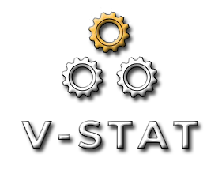

# 
[Try the app here](https://vstatapp.herokuapp.com/)

## Problem

* Customers are often left in the dark when it comes to the status of their vehicle repair after submitting a claim. 
* There's a lot of "he said, she said" between mechanics and insurers meanwhile you're just wondering when you will get your car back. 

## Our Purpose
V-STAT creates transparency and efficiency by bringing all parties together on a single platform to communicate and post updates about the repair process. 

## How do we do it?
* We've built a system that allows insurers to post tickets with a vehicles case number and pertinent details. 
* Mechanics can view these tickets when assigned, and fill create a simple task list that entails what repairs need to be done on this vehicle. As the mechanic completes the repairs they can move these tasks to a completed status, which keeps insurers and customers up to date with the STATus of this Vehicle. 
* There's also a comment thread where any party can drop questions/concerns on this ticket view page. This allows all three parties to communicate in the same space so that no one is left behind.

## Outcomes
* There is total transparency during the repair process - mission accomplished!
* Decreases time-in-shop by holding mechanics accountable for the vehicle task list
* Increases customer satisfaction by including them in the conversation and giving updates every step of the way.

### Technologies Used
MySql, Express, React, Node, Sequelize, Passport, React-Bootstrap

### Future goals
* Email/text push notifications to update all parties when the status of their ticket(s) have changed. 
* Picture upload feature to visually show customers the progress made on their vehicle